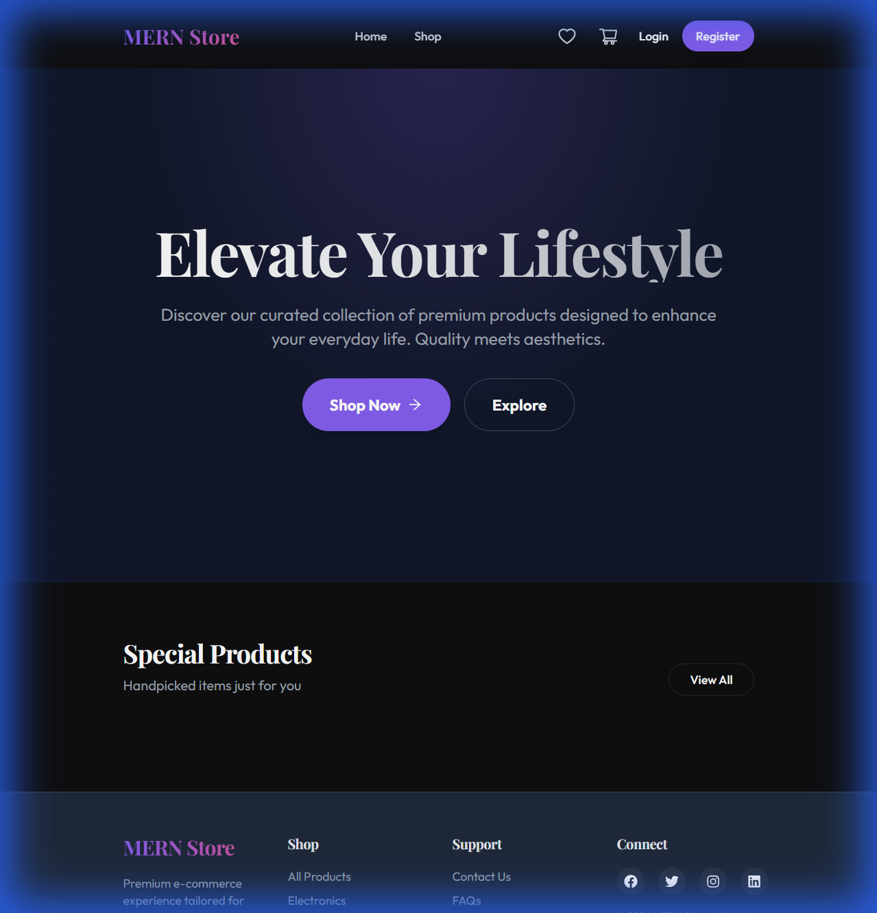
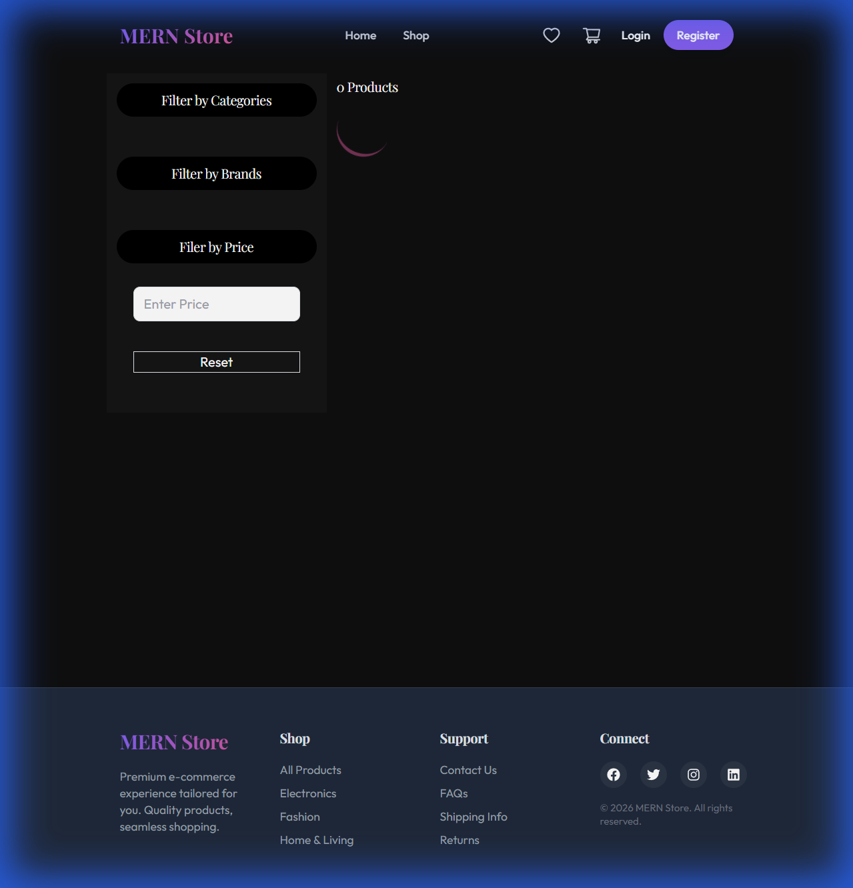
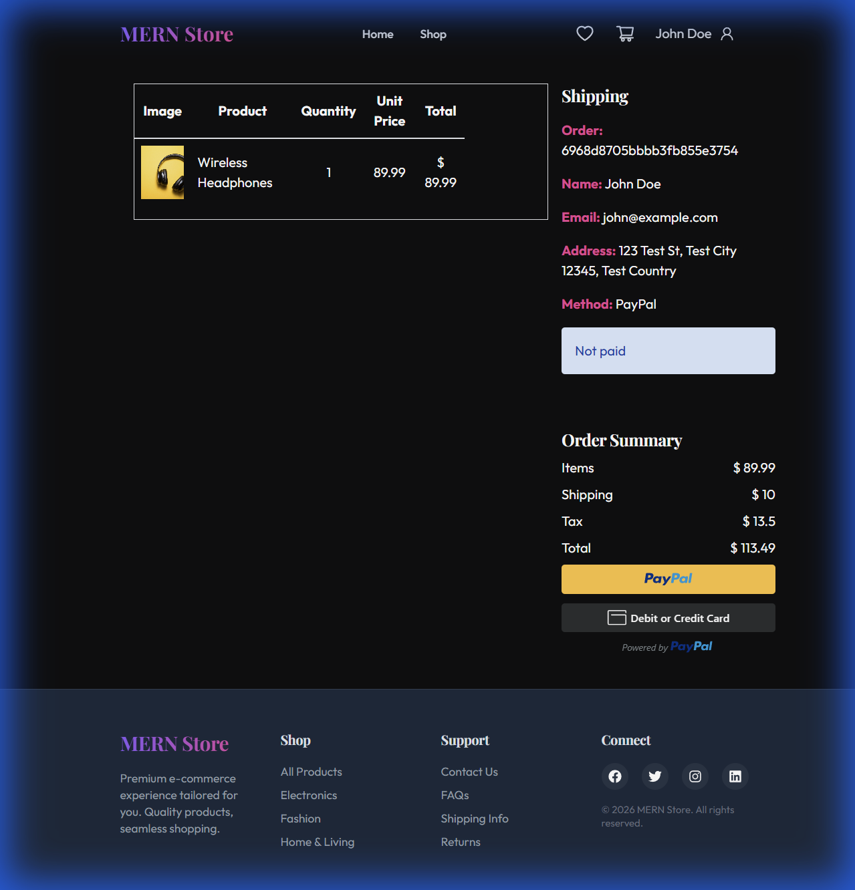

# MERN Stack E-commerce Project 🛍️



A full-stack E-commerce application built with the **MERN** stack (MongoDB, Express, React, Node.js), featuring a premium UI/UX, real-time database, secure authentication, and payment integration.

## 🚀 Key Features

*   **Premium UI/UX:** Dark mode aesthetic with glassmorphism effects, modern typography (Outfit/Playfair), and smooth animations using `framer-motion`.
*   **User Authentication:** Secure Login/Register functionality with JWT authentication and HTTP-only cookies.
*   **Product Management:** Admin dashboard to Create, Read, Update, and Delete products and categories.
*   **Shopping Cart:** Real-time cart management with Redux Toolkit.
*   **Checkout Process:** Multi-step checkout flow (Shipping, Payment Method, Order Summary).
*   **Payment Integration:** PayPal integration (Mock/Sandbox ready).
*   **Order History:** Users can view their past orders and payment status.
*   **Search & Filtering:** Advanced filtering by Category, Price, and Brand.
*   **Reviews & Ratings:** Users can rate and review products.

## 🛠️ Technology Stack

**Frontend:**
*   **React** (Vite)
*   **Tailwind CSS** (Styling)
*   **Framer Motion** (Animations)
*   **Redux Toolkit** (State Management & RTK Query)
*   **React Router DOM** (Routing)

**Backend:**
*   **Node.js** & **Express**
*   **MongoDB** (Database)
*   **Mongoose** (ODM)
*   **JWT** (Authentication)
*   **Multer** (Image Uploads)

## 📸 Screenshots

### Shop Page


### Order Details


## ⚙️ Installation & Setup

1.  **Clone the repository**
    ```bash
    git clone https://github.com/Daksh54/MERN-Stack-Ecommerce-Project.git
    cd MERN-Stack-Ecommerce-Project
    ```

2.  **Install Dependencies**
    ```bash
    # Install backend dependencies
    npm install

    # Install frontend dependencies
    cd frontend
    npm install
    cd ..
    ```

3.  **Environment Configuration**
    Create a `.env` file in the root directory:
    ```env
    PORT=5000
    MONGO_URI=your_mongodb_connection_string
    JWT_SECRET=your_jwt_secret
    PAYPAL_CLIENT_ID=your_paypal_client_id
    ```

4.  **Seed Database (Optional)**
    Populate the database with dummy data:
    ```bash
    node backend/utils/seeder.js
    ```

5.  **Run the Application**
    ```bash
    # Run both backend and frontend concurrently
    npm run dev
    ```

## 🤝 Contributing

Contributions are welcome! Please fork the repository and submit a pull request.

## 📄 License

This project is licensed under the ISC License.
